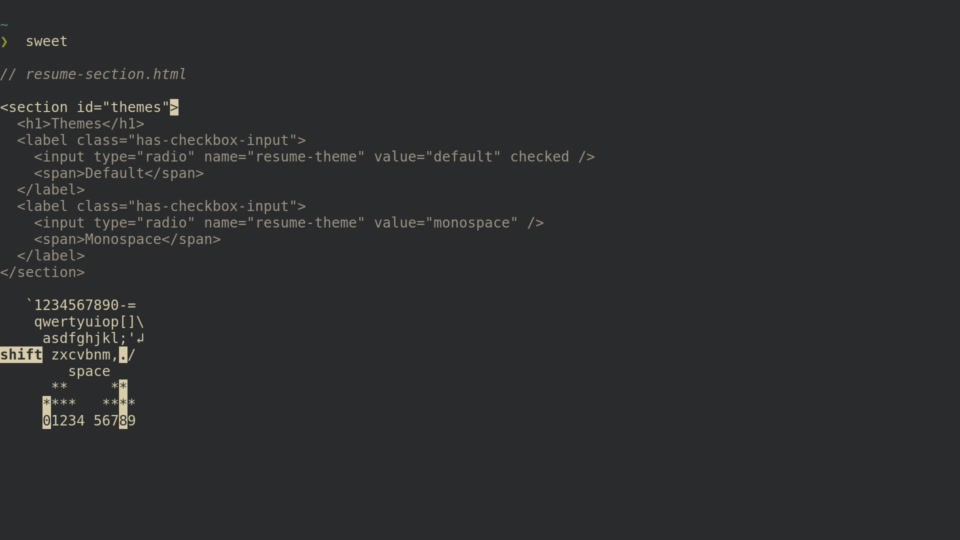
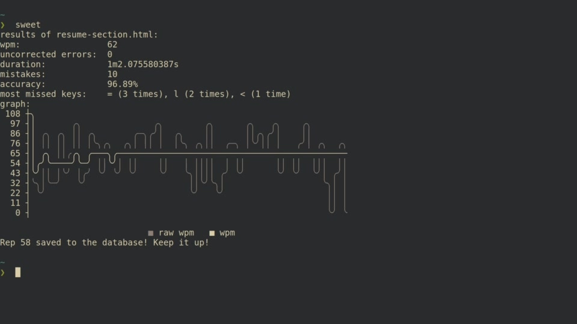
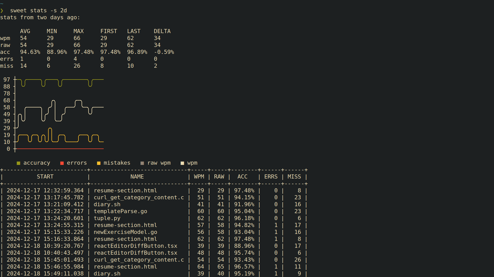

# Sweet

```
Hey! That's

         ,gg,                                                  gg  
        i8""8i                                        I8      ,gg, 
        `8,,8'                                        I8      i88i 
         `88'                                      88888888   i88i 
         dP"8,                                        I8      i88i 
        dP' `8a  gg    gg    gg    ,ggg,    ,ggg,     I8      ,gg, 
       dP'   `Yb I8    I8    88bg i8" "8i  i8" "8i    I8       gg  
   _ ,dP'     I8 I8    I8    8I   I8, ,8I  I8, ,8I   ,I8,          
   "888,,____,dP,d8,  ,d8,  ,8I   `YbadP'  `YbadP'  ,d88b,     aa  
   a8P"Y88888P" P""Y88P""Y88P"   888P"Y888888P"Y88888P""Y88    88  
```

[](https://pkg.go.dev/github.com/NicksPatties/sweet)

<!--toc:start-->
- [Sweet](#sweet)
  - [What is Sweet?](#what-is-sweet)
  - [Installation](#installation)
    - [Using `go`](#using-go)
    - [Downloading an executable](#downloading-an-executable)
    - [Via your system's package manager](#via-your-systems-package-manager)
  - [Usage](#usage)
    - [`sweet` - Run a typing exercise](#sweet---run-a-typing-exercise)
      - [Adding new exercises](#adding-new-exercises)
      - [Using a specific language](#using-a-specific-language)
      - [With a different exercises directory](#with-a-different-exercises-directory)
      - [With a specific file](#with-a-specific-file)
      - [Using piped input](#using-piped-input)
    - [`sweet stats` - Print typing exercise statistics](#sweet-stats---print-typing-exercise-statistics)
      - [For the past two weeks](#for-the-past-two-weeks)
      - [Using a date range](#using-a-date-range)
      - [For specific programming languages](#for-specific-programming-languages)
      - [For specific exercises](#for-specific-exercises)
      - [View specific metrics](#view-specific-metrics)
  - [Contributions](#contributions)
  - [License](#license)
- [Contributor instructions](#contributor-instructions)
  - [Running the application](#running-the-application)
  - [Testing](#testing)
    - [Running unit tests for a module](#running-unit-tests-for-a-module)
    - [Running unit tests for all modules](#running-unit-tests-for-all-modules)
    - [Building and reviewing test coverage](#building-and-reviewing-test-coverage)
  - [Building a release version](#building-a-release-version)
  - [Creating a new command](#creating-a-new-command)
  - [Writing e2e tests](#writing-e2e-tests)
<!--toc:end-->

## What is Sweet?

**Sweet** is a **S**oft**w**are **E**ngineering **E**xercise for **T**yping. In other words, it's a touch typing exercise command line interface specifically designed for programmers.

## Installation

### Using `go`

Assuming you have `go` installed, you can use the following command:

```sh
go install github.com/NicksPatties/sweet@latest
```

### Downloading an executable

1. Go to the [releases](https://github.com/NicksPatties/sweet/releases) page.

2. Download the executable with the matching operating system and architecture in the file name and its corresponding checksum file. The executables in the release are shown in the format `sweet-<os>-<architecture>`.

3. Verify your downloaded executable using the `sha256sum` command. Note that the checksum and the executable should be in the same directory and have the same basename.

  ```sh
  # with <sweet_executable> and <sweet_executable>.sha256 in the current dir 
  sha256sum <sweet_executable>.sha256 --check
  # <sweet_executable>: OK
  ```
  If the checksums do not match, **do not run the file**. Please [report an issue](https://github.com/NicksPatties/sweet/issues) if something is wrong.

4. Use `chmod` to make the executable actually executable.

  ```sh
  chmod u+x <sweet_executable>
  ```

5. Move the executable to a directory that is included in your `$PATH`, and rename it to `sweet`.

  ```sh
  mv <sweet_executable> <somewhere_on_path>/sweet
  ```

You're now ready to use `sweet`!

### Via your system's package manager

[Todo](https://github.com/NicksPatties/sweet/issues/49)

## Usage

### `sweet` - Run a typing exercise

```sh
sweet
```



This runs a random exercise from sweet's exercises directory. Once complete, you'll see the results of your exercise. Here's an example:



Once complete, the stats for the repetition will be saved in an SQLite database. By default, the database is located in `$HOME/.config/sweet/sweet.db`.

#### Adding new exercises

By default, exercises are located in `$HOME/.config/sweet/exercises`. If this directory doesn't exist, [it will be created](https://github.com/NicksPatties/sweet/blob/main/cmd/root/sweet.go#L516-L531), and [some default exercises will be added](https://github.com/NicksPatties/sweet/blob/main/cmd/root/sweet.go#L44-L89).

Add more files to the exercises directory if you'd like to include them in the random exercise rotation!

#### Using a specific language

```sh
sweet -l [extension]
```

Selects a random file within the exercises directory that matches a given extension. If no matching extension is found, then the program ends with an error.

#### With a different exercises directory

Use the `$SWEET_EXERCISES_DIR` environment variable.

```sh
$SWEET_EXERCISES_DIR="~/.exercises" sweet
```

#### With a specific file

```sh
sweet [file]
```

If your file is really large, use the `-s` and `-e` flags to select the starting and ending lines of the exercise, respectively.

```sh
sweet [really-large-file] -s 100 -e 110
```

#### Using piped input

Use the `-` filename to create an exercise with standard input.

```sh
curl https://nickspatties.com/main.go | sweet -
```

You can still use the `-s` and `-e` flags if you want to filter your exercise input.

```sh
curl https://raw.githubusercontent.com/NicksPatties/sweet/refs/heads/main/cmd/root/sweet.go | sweet - -s 381 -e 385
```

### `sweet stats` - Print typing exercise statistics

```sh
sweet stats
```



#### For the past two weeks

```sh
sweet stats --since=2w
```
- You can also query by hours (`h`), days (`d`), months (`m`), and years (`y`)

#### Using a date range

```sh
sweet stats --start=YYYY-MM-DD --end=YYYY-MM-DD
```

#### For specific programming languages

For Go:

```sh
sweet stats --lang=go
```

For Python:

```sh
sweet stats --lang=py
```

#### For specific exercises

To see all the stats for the past day for the exercise `hello.go`:

```sh
sweet stats --name=hello.go
```

You can also use the `*` wildcard to perform a partial match. For instance:

```sh
sweet stats --name=hello*
```
- This will match all exercises that have the name "hello" at the beginning 

#### View specific metrics

By default, you'll see the wpm, raw wpm, accuracy, errors, and mistakes when you query your stats.

If you'd only like to see specific metrics, pass the flags of the stats. For example, this will show the wpm and mistakes columns.

```sh
sweet stats --wpm --miss
```

## Contributions

If you notice any bugs, or have general feedback regarding your experience using `sweet`, please post an [issue](https://github.com/NicksPatties/sweet/issues) in our GitHub repo. You may also email me at [nickspatties@proton.me](mailto:nickspatties@proton.me?subject=Sweet%20Issue%3A%20%3CYour%20issue%20title%20here%3E&body=Sweet%20version%3A%20%3Csweet%20version%3E%0D%0ADetails%3A%20%3Cadd%20details%20here%3E).

Wanna contribute a change to the code? Please fork the repository, and then submit a pull request!

## License

[MIT](LICENSE)

# Contributor instructions

## Running the application

```sh
go build .
./sweet
```

## Testing

### Running unit tests for a module

```sh
go test ./{{module-name}}
```

### Running unit tests for all modules

```sh
go test ./...
```

### Building and reviewing test coverage

```sh
go test -coverprofile coverage {{module-path}} && go tool cover -html=coverage
```

For example, building the coverage profile, building the html page, and then running it with a browser:

```sh
go test -coverprofile c.out ./cmd/root && go tool cover -html=c.out -o c.html && brave-browser c.html
```

## Building a release version

Creates a release to GitHub, and updates the pkg.go.dev listing.

```sh
# Assuming you're currently on the commit you'd like to release
git checkout main
git tag {{version}}
git push origin {{version}}
./release
```

## Creating a new command

1. Create new file called `{{command}}/{{command}}.go`
  - `package {{command}}`
  - `const CommandName = "{{command}}"`
2. Create a function in new file called `Run`
  - should return an int
  - should accept `[]string` as first parameter for args
  - should accept any other inputs it needs
3. (optional) Add `{{command}}Cmd` variable of type `*flags.FlagSet`
4. Create a test file `{{command}}/{{command}}_test.go`
5. In `sweet.go`, add func signature from step 2 to `Commands` struct
6. In `Run` in `sweet.go`, add a case to the `switch subCommand` statement
7. In `Main` in `sweet.go`, add the `Run` function from your new `{{command}}` module to the `defaultCommands` struct.
8. Valiate flags in the `&cobra.Command`'s struct, then pass valid params to the `Run` function

By now you should have a new command that you can run and test like its own standalone application.

## Writing e2e tests

See `e2e/exercise_test.sh` and `e2e/e2e_test_template.sh` for examples.

